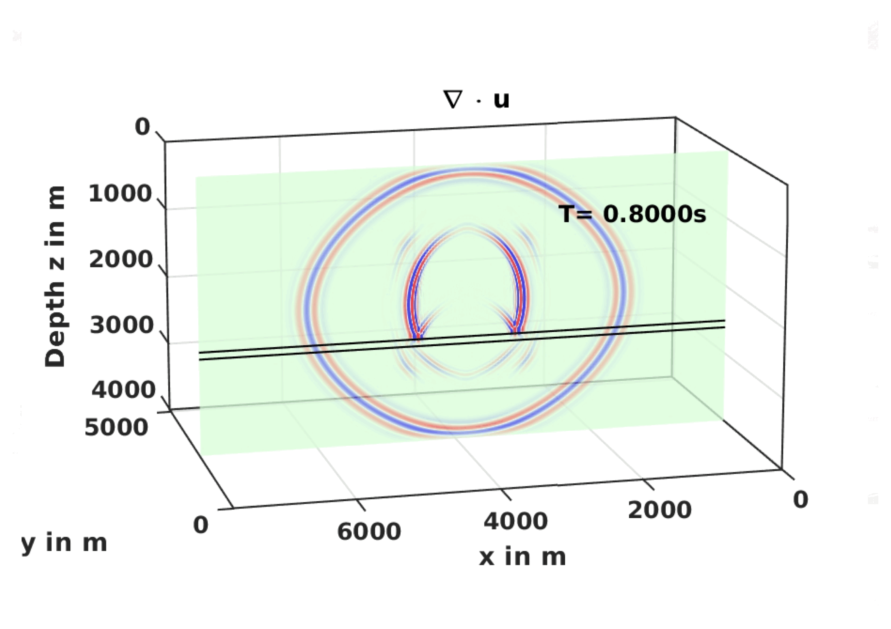

## About

CircleCI status:

ASOFI3D stands for Anisotropic Seismic mOdeling with FInite differences in 3D.
This code is intended for the modeling of seismic wave propagation and
is based on 
[SOFI3D](https://git.scc.kit.edu/GPIAG-Software/SOFI3D/wikis/home) code
with the addition of orthorhombic anisotropy.

## Obtaining the code

Get the code from this repo:

    git clone git@github.com:swag-kaust/ASOFI3D.git

Then switch to the created directory:

    cd ASOFI3D

## Building the code

The prerequisites for ASOFI3D are:

* C compiler (for example, `gcc`), which supports C11 standard
* MPI library (for example, [OpenMPI](https://www.open-mpi.org/))
* [GNU Make](https://www.gnu.org/software/make/) build system

## Building the code with gcc and OpenMPI on Ubuntu

On recent Ubuntu versions such as 14.04, 16.04, or 18.04 all prerequisites
can be obtained by the following commands:

    sudo apt-get install gcc libopenmpi-dev make

Then while in the root directory of the code, build the code via command

    make

which compiles the solver and several auxiliary utilities.

Before compilation, make will automatically test for the ability to compile
MPI programs and generate file `src/config-auto.mk` with the flags for
compilation.

## Example usage

After successful compilation, you can run the code via command

    ./run_asofi3D.sh np dirname

where `np` is a number of MPI processes you want to use and `dirname` is the
directory that contains configuration of the problem to solve.
Parameter `dirname` is optional and defaults to `par`, so that the main
configuration file of the solver is `par/in_and_out/asofi3D.json`.

## Running the tests

To run the tests, [Madagascar](http://www.ahay.org) is an additional prerequisite.
Tests are run via the command

    make test
